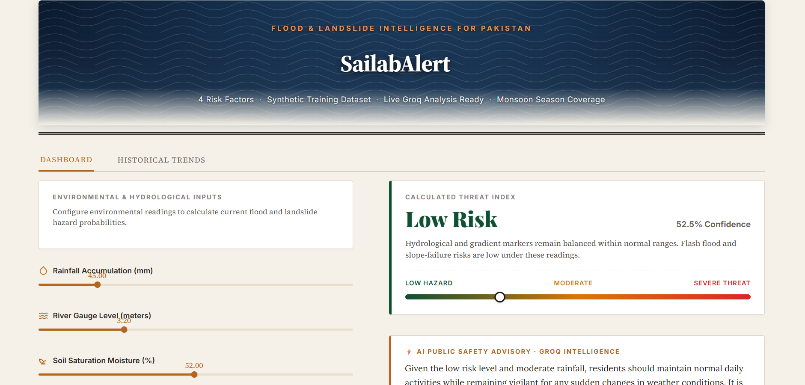
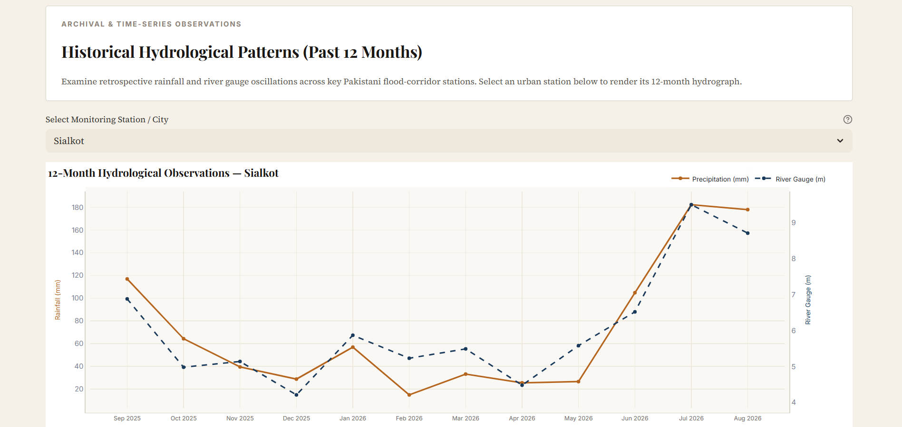
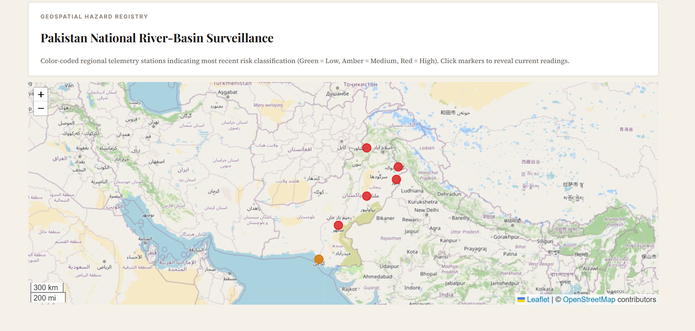
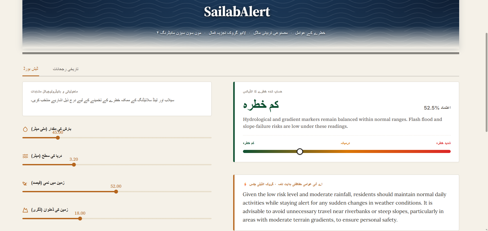

<div align="center">

# 🌊 SailabAlert

### AI-Powered Flood & Landslide Early Warning System for Pakistan

*Predicting disaster risk before it strikes — powered by Machine Learning and Generative AI*

<br>


<br>

**[Live Demo](#-live-demo)** · **[Features](#-features)** · **[Installation](#-installation)** · **[How It Works](#-how-it-works)** · **[Future Scope](#-future-scope)**

</div>

<br>

---

## 📖 Overview

**SailabAlert** ("Sailab" — سیلاب, Urdu for *flood*) is a disaster early-warning web application built for Pakistan, where flash floods and landslides regularly threaten lives and property during monsoon season. Communities and local authorities often lack accessible, real-time tools to assess environmental risk before disaster strikes.

SailabAlert combines a trained **Machine Learning classifier** with a **generative AI safety advisor** to turn raw environmental readings — rainfall, river gauge level, soil saturation, and terrain slope — into an instant, plain-language risk assessment and actionable safety guidance, available in both **English and Urdu**.

This project was built as a demonstration of applied AI for social good, combining classical ML, LLM-based reasoning, and geospatial visualization in a single, deployable tool.

<br>

## 🎥 Live Demo

<div align="center">

*[Add your deployed Streamlit Community Cloud link here]*

`https://sailabalert.streamlit.app`

</div>

<br>

## 🖼️ Screenshots

<div align="center">

| Dashboard | Historical Trends |
|:---:|:---:|
|  |  |

| Risk Map | Urdu Interface |
|:---:|:---:|
|  |  |

</div>

> Replace the images above by adding your own screenshots to a `/screenshots` folder in the project root.

<br>

## ✨ Features

| Feature | Description |
|---|---|
| 🎯 **Risk Prediction** | A Random Forest Classifier trained on rainfall, river level, soil moisture, and slope angle predicts **Low / Medium / High** risk with a confidence score |
| 🤖 **AI Safety Advisor** | Integrates the **Groq API** (Llama 3.3) to generate a natural-language, context-specific safety recommendation for every prediction |
| 📊 **Historical Trends** | Interactive Plotly charts showing 12 months of rainfall and river gauge data across major Pakistani cities |
| 🗺️ **Live Risk Map** | A Folium map pinning key monitoring stations (Karachi, Lahore, Peshawar, Multan, Sialkot, Sukkur), color-coded by current risk level |
| 🚨 **Alert Simulation** | Automatically simulates an SMS/email dispatch log when a High-risk threshold is crossed |
| 🌐 **Bilingual Interface** | Full English ⇄ Urdu (اردو) toggle for the entire dashboard |
| 🎨 **Editorial Design** | A clean, distinctive interface inspired by data-journalism dashboards — not a generic SaaS template |

<br>

## 🧠 How It Works

```
┌─────────────────┐     ┌──────────────────┐     ┌────────────────────┐
│  User Input      │────▶│  ML Risk Model    │────▶│  Risk Label +      │
│  (sliders)       │     │  (Random Forest)  │     │  Confidence Score  │
└─────────────────┘     └──────────────────┘     └──────────┬─────────┘
                                                              │
                                                              ▼
                                                   ┌────────────────────┐
                                                   │  Groq AI Agent     │
                                                   │  (Llama 3.3)       │
                                                   │  → Safety Advisory │
                                                   └──────────┬─────────┘
                                                              │
                                                              ▼
                                                   ┌────────────────────┐
                                                   │  Dashboard Display  │
                                                   │  + Alert Simulation │
                                                   │  (if High risk)     │
                                                   └────────────────────┘
```

1. **Input** — the user enters four environmental readings (or selects a monitored city).
2. **Prediction** — a Random Forest model, trained on a labeled synthetic dataset representing realistic Pakistani monsoon conditions, classifies the risk as Low, Medium, or High.
3. **Explanation** — the predicted risk and raw inputs are passed to the Groq API, which generates a short, human-readable safety recommendation.
4. **Verification-free by design** — the AI only explains an already-computed, deterministic ML result; it never determines the risk level itself, keeping the core prediction transparent and auditable.
5. **Alert** — if the risk crosses the High threshold, a simulated multi-channel alert log is displayed.

<br>

## 🛠️ Tech Stack

| Layer | Technology |
|---|---|
| **Frontend** | [Streamlit](https://streamlit.io/) |
| **Machine Learning** | [scikit-learn](https://scikit-learn.org/) (Random Forest Classifier) |
| **Generative AI** | [Groq API](https://console.groq.com/) — `llama-3.3-70b-versatile` |
| **Visualization** | [Plotly](https://plotly.com/python/) · [Folium](https://python-visualization.github.io/folium/) |
| **Data** | Synthetic dataset (real data sources scoped for future integration) |

<br>

## 📂 Project Structure

```
SailabAlert/
├── app.py                 # Main Streamlit app — UI, navigation, state
├── model.py                # Synthetic data generation, model training & inference
├── agent.py                 # Groq API wrapper — safety advisory generation
├── utils.py                # Shared helpers — data processing, map rendering
├── requirements.txt         # Python dependencies
├── .streamlit/
│   └── config.toml          # Theme configuration
├── AGENTS.md                 # Project memory file (for AI coding assistants)
└── README.md                 # You are here
```

<br>

## 🚀 Installation

### Prerequisites
- Python 3.10 or higher
- A free [Groq API key](https://console.groq.com/) (no credit card required)

### Setup

```bash
# 1. Clone the repository
git clone https://github.com/<your-username>/SailabAlert.git
cd SailabAlert

# 2. Create a virtual environment
python -m venv venv
source venv/bin/activate      # On Windows: venv\Scripts\activate

# 3. Install dependencies
pip install -r requirements.txt

# 4. Set your Groq API key
export GROQ_API_KEY="your_api_key_here"     # On Windows (PowerShell):
                                              # $env:GROQ_API_KEY="your_api_key_here"

# 5. Run the app
streamlit run app.py
```

The app will open automatically at `http://localhost:8501`.

<br>

## 🔮 Future Scope

- [ ] **Real dataset integration** — replace synthetic training data with live sources: Pakistan Meteorological Department (PMD), WAPDA river gauge data, NASA POWER rainfall API, and SRTM elevation data
- [ ] **Full RTL support** — proper right-to-left text flow and layout mirroring for the Urdu interface
- [ ] **Real alert dispatch** — integrate an actual SMS/email gateway (e.g. Twilio) in place of the current simulation
- [ ] **Offline-first design** — enable core functionality in low-connectivity rural areas
- [ ] **Mobile-responsive layout** — optimize the dashboard for smaller screens
- [ ] **Historical accuracy validation** — backtest predictions against real historical flood events (EM-DAT, Kaggle Pakistan floods dataset)

<br>

## ⚠️ Disclaimer

This project uses a **synthetic training dataset** for demonstration purposes and is **not** connected to any official government early-warning system. It should not be used as a sole source of information in an actual emergency. Always follow guidance from the **National Disaster Management Authority (NDMA)** and local civil authorities.

<br>

## 📄 License

This project is licensed under the MIT License — see the [LICENSE](LICENSE) file for details.

<br>

<div align="center">

**Built with ❤️ for disaster resilience in Pakistan**

</div>
